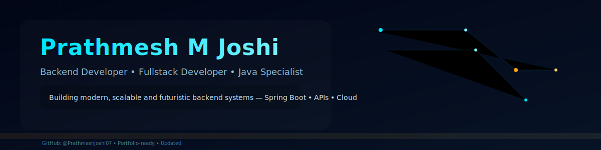
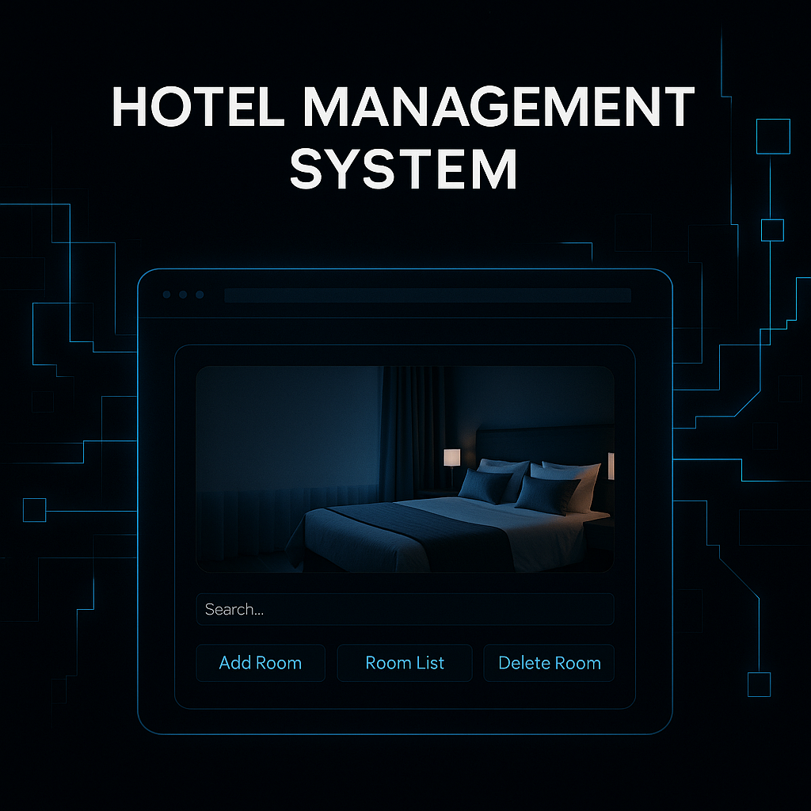
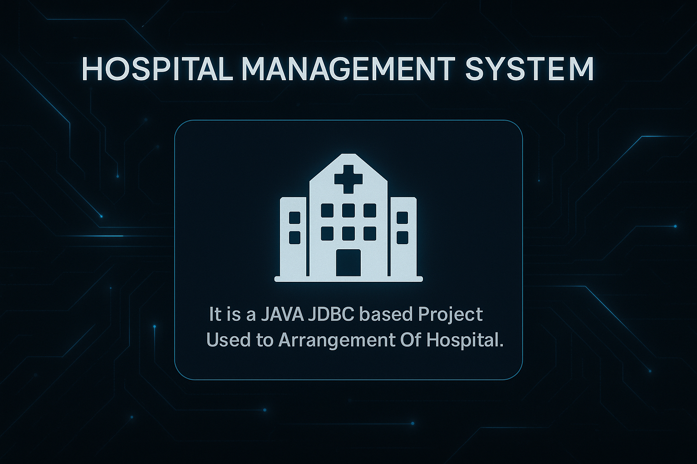

  

<!-- 🔥 Futuristic + Professional GitHub Profile README for Prathmesh Joshi -->

<h3>Passionate To Build Modern Futuristic Digital Experiences ⚡</h3>
Backend Developer • Fullstack Developer • Java Specialist 

---

## 🔗 Social & Profile Stats  

---

## 🧑‍💻 About Me  

I’m **Prathmesh Joshi**, a passionate **Backend & Fullstack Developer** with strong expertise in **Java**, **Spring**, and building scalable backend systems.

I love creating clean, high-performance applications with a futuristic approach. Constantly learning, improving, and building.

---

## 🎯 Quick Highlights  

🧠 Problem Solver • ⚡ Fast Learner • 🤝 Team Player • 🛠 Project Management  
 
🌱 Currently learning **Spring Boot**, **Backend Architecture**, and **Advanced Java**  
 
🚀 Vision: *To build meaningful, scalable products and evolve with future-ready tech.*

---

## 🛠 Tech Stack  

<table>
<tr>

<td align="center" width="33%">
  
### 🧩 Languages  

</td>

<td align="center" width="33%">

### ⚙️ Backend & Frameworks  

</td>

<td align="center" width="33%">

### 🧰 Tools  

</td>

</tr>
</table>

---

## 📊 GitHub Analytics

  
 
 

---

## 🖼️ Project Showcase

<table>
  <tr>
    <!-- Hotel -->
    <!-- Project: Hotel (with Discussion button) -->
<td align="center" style="padding:12px;">
  
   
  <b>Hotel Management System</b> A Spring MVC + JSP based room management app.

  <!-- Start Discussion button (collaboration) -->
  

    
  

  <!-- Short guidance under the button -->
  

    <b>Want to collaborate?</b> Click the button → choose <i>collaboration</i> Start Discussion in GENERAL CHAT.
  

</td>
    <!-- Tender -->
    <td align="center" style="padding:12px;">
      
       
      <b>Tender Recommendation System</b> Recommends tenders using Java logic.
    </td>
  <!-- Hospital -->
    <td align="center" style="padding:12px;">
      
       
      <b>Hospital Management System</b> JAVA JDBC project for hospital arrangements.
    </td>

  </tr>
</table>

---

## 🧩 Extra Sections (Collapsible)

<h3>📘 My Learning Roadmap for Future</h3>

- Spring Boot Advanced  
- Microservices  
- System Design Basics  
- Cloud Deployment (AWS)  
- DevOps Tools  

---

## ✨ My Developer Style  
✔ Professional & modern  
✔ Futuristic mindset  
✔ Friendly & collaborative  
✔ Clean architecture believer  

---

## ☕ Final Thoughts  
> *“Keep building. Keep improving. The future belongs to developers who never stop learning.”*

---
